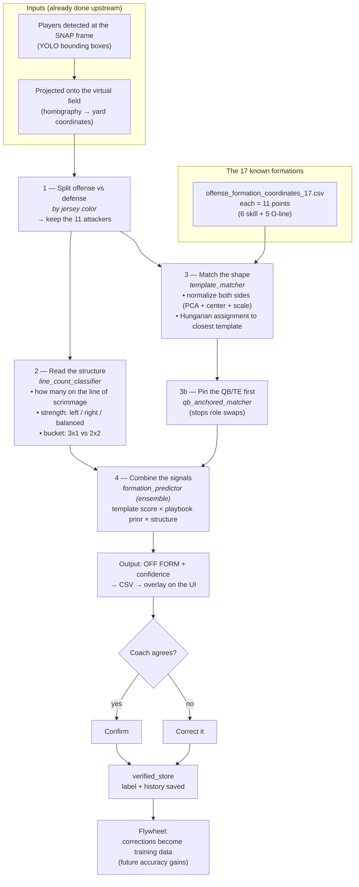

# Formation Detection — Slide Diagram & Talking Points

*My part of the pipeline. (Player + QB detection is covered by my teammate — this
picks up from the players already on the virtual field.)*

---

## The diagram

---

## What to say at each box (your script)

**Inputs.** "By this point we already have every player detected and dropped onto a
top-down virtual field in real yard coordinates, frozen at the snap — that's the
pre-snap alignment, which is what a formation actually is."

**1 — Split offense vs defense.** "First I separate the two teams by **jersey
color**, not the detector's labels, because the detector leaks defenders onto
offense. Then I keep just the **11 attackers** — those are the only players a
formation describes."

**2 — Read the structure.** "Before any fancy matching, I read the *structure*:
how many players are on the line of scrimmage, which way the strength goes, and
whether it's a 3-by-1 or 2-by-2 look. This is the **most reliable signal we have,
about 60–70%**, and it's the read the coach cares about most."

**3 — Match the shape.** "Then I compare the players' shape against **17 known
formations** stored as coordinates in a CSV. I normalize both the detected
players and each template — recenter and rescale them — so the match works no
matter where on the field or which direction the play is going. A QB-anchored
version pins the quarterback first so roles don't get swapped."

**4 — Combine the signals.** "No single signal is strong alone, so I **combine**
them: the template match, a playbook prior (how often this team actually calls
each formation), and the structure read. That ensemble is the final formation."

**Output + human-in-the-loop.** "It outputs a formation with a confidence score,
overlaid on the video. The coach either confirms it or corrects it in one click —
and every correction is saved as **training data**, so the system gets better
over time. That flywheel matters because exact accuracy today is ~30%, limited by
camera angle, so the human stays in the loop."

---

## The honest accuracy line (have this ready for questions)

- Exact formation: **~27%**, family: **~34%** (ensemble, on 56 labeled clips).
- Structure read (line count): **~60–70%** — the actually-useful number.
- Ceiling is the **camera angle**, not the algorithm — wide-angle film hides the
  depth cues that separate variants. That's *why* the human-in-the-loop + flywheel
  exist.
