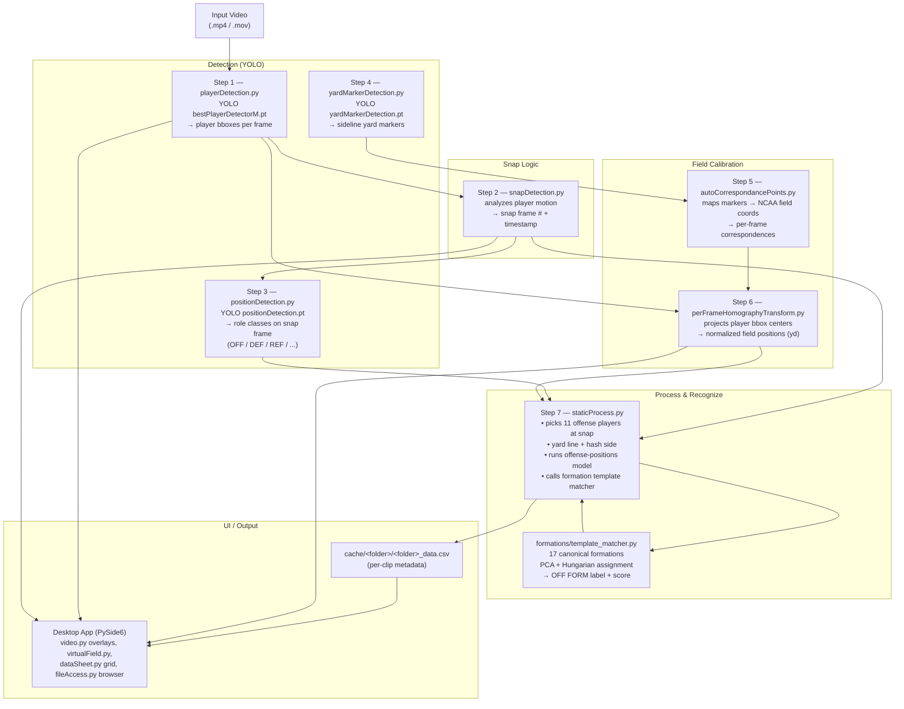

# Software Architecture

This document describes the architecture of the Hudl AI Analysis tool: a PySide6
desktop application that ingests football game video and produces per-play
analytics (snap frame, player positions on a normalized field, offense formation,
yard line / hash). It is intended as a reference for partner / report writing.

---

## 1. High-Level Workflow

The system takes an input video and pushes it through a fixed 7-step pipeline.
Each step writes a JSON artifact into `cache/<folder>/...`; the next step reads
that artifact. The desktop UI overlays these artifacts on the video and on a
virtual field, and stores per-clip metadata in a folder-level CSV.



### One-line summary of the data flow

`video → players (YOLO) → snap frame → positions (YOLO) + yard markers (YOLO)
→ field homography → static process → formation match → CSV + UI overlay`

---

## 2. Component Layout

| Folder            | Purpose                                                                                       |
| ----------------- | --------------------------------------------------------------------------------------------- |
| `app/`            | PySide6 desktop GUI (main window, video player, virtual field, data sheet, processing dialogs) |
| `scripts/`        | The 7-step processing pipeline + utilities (`renderFieldVideo.py`, `extractSnapFrames.py`)    |
| `formations/`     | Template-based offense formation recognizer + 17 canonical formations CSV                     |
| `models/`         | Offense-positions MLP weights + metadata, consumed by Step 7                                  |
| `yolo_models/`    | YOLO weights (Git LFS): player detector, position detector, yard-marker detector              |
| `modelTraining/`  | Training utilities for the offense-positions model (not bundled in the EXE)                   |
| `cache/`          | Runtime per-folder JSON + CSV artifacts produced by the pipeline (not checked in)             |
| `data/`           | Local-only training/validation video data — gitignored                                        |

---

## 3. Pipeline Steps in Detail

The full catalog with CLI examples lives in [scripts/docs.md](scripts/docs.md).
Each step is independently runnable for iteration, and the processing dialogs
in `app/processingDialog.py` (single clip) and `app/batchProcessingDialog.py`
(whole folder) orchestrate them end-to-end.

| # | Script                            | Model                              | Input                                       | Output                                  |
| - | --------------------------------- | ---------------------------------- | ------------------------------------------- | --------------------------------------- |
| 1 | `playerDetection.py`              | `bestPlayerDetectorM.pt` (YOLO)    | video                                       | per-frame player bboxes (JSON)          |
| 2 | `snapDetection.py`                | heuristic (motion analysis)        | player JSON                                 | snap frame # + timestamp (JSON)         |
| 3 | `positionDetection.py`            | `positionDetection.pt` (YOLO)      | video + snap JSON                           | role classes on snap frame (JSON)       |
| 4 | `yardMarkerDetection.py`          | `yardMarkerDetection.pt` (YOLO)    | video                                       | yard markers per frame (JSON)           |
| 5 | `autoCorrespondancePoints.py`     | —                                  | yard-marker JSON                            | pixel ↔ field coord pairs (JSON)        |
| 6 | `perFrameHomographyTransform.py`  | OpenCV homography                  | player JSON + correspondence JSON           | normalized field positions in yd (JSON) |
| 7 | `staticProcess.py`                | offense-positions MLP + template matcher | snap JSON + position JSON + homography JSON | per-clip CSV row (yard line, hash, OFF FORM) |

### Auxiliary

- `scripts/shotgunDetection.py` — recently added heuristic on top of Step 7 data to flag shotgun vs. under-center.
- `scripts/renderFieldVideo.py` — renders the normalized positions to a stylized field video for debugging.
- `formations/validate_formations.py` — validates template-matcher predictions against coach labels.

---

## 4. Formation Recognition (template matcher)

`formations/template_matcher.py` does **no training**. Given the 11 offense
players at the snap (extracted by `staticProcess.py`):

1. Build an 11-point template per formation: 6 skill players from the CSV +
   5 OL anchored on the LOS.
2. Canonicalize both detected and template sets via PCA → center → isotropic
   RMS scale normalization. This is invariant to field location, orientation,
   and schematic-vs-measured scale.
3. Hungarian assignment between detected and template points (mirror-invariant).
4. Return the closest formation + a 0–1 score (~0.2 = clean match, ~0.6 = poor).

This was chosen over a trained classifier because we only have ~89 noisy
labeled clips; the 17 templates encode the formations directly and keep
per-formation distances interpretable.

---

## 5. Desktop Application (`app/`)

| Module                      | Role                                                                  |
| --------------------------- | --------------------------------------------------------------------- |
| `application.py`            | `QMainWindow`, menu bar, dock layout, folder selection, dark mode     |
| `video.py`                  | Video player + overlays (player bboxes, snap marker, formation label) |
| `virtualField.py`           | 2D field view fed by Step 6 normalized positions                      |
| `dataSheet.py`              | Editable per-clip metadata grid backed by `<folder>_data.csv`         |
| `fileAccess.py`             | Folder browser + thumbnail generation                                 |
| `processingDialog.py`       | Single-clip Step 1–7 runner                                           |
| `batchProcessingDialog.py`  | Whole-folder Step 1–7 runner                                          |
| `palette.py`                | Light / dark Qt palettes                                              |

When the build is frozen by PyInstaller (`hudl_ai.spec`), the dialogs
re-invoke the bundled executable with `PYINSTALLER_RUN_SCRIPT` so each
script runs inside the frozen interpreter without needing system Python.

---

## 6. Models

| Model                                  | Type           | Used by                          |
| -------------------------------------- | -------------- | -------------------------------- |
| `yolo_models/bestPlayerDetectorM.pt`   | YOLO (ultralytics) | Step 1 (player detection)    |
| `yolo_models/positionDetection.pt`     | YOLO           | Step 3 (offense/defense/ref)     |
| `yolo_models/yardMarkerDetection.pt`   | YOLO           | Step 4 (sideline markers)        |
| `models/offense_positions/`            | PyTorch MLP    | Step 7 (offense play-type)       |
| `formations/offense_formation_coordinates_17.csv` | template set | Step 7 (formation match) |

---

## 7. Runtime Artifacts (`cache/<folder>/`)

```
cache/<folder>/
├── players/<clip>_detection.json            # Step 1
├── snap_detection/<clip>_snap_detection.json # Step 2
├── positions/<clip>_position.json            # Step 3
├── yard_markers/<clip>_yard_markers.json     # Step 4
├── correspondence/<clip>_correspondence.json # Step 5
├── homography/<clip>_normalized_positions.json # Step 6
├── offense_positions.csv                     # Step 7 training-data append
└── <folder>_data.csv                         # Step 7 per-clip metadata (UI source of truth)
```

The UI watches `<folder>_data.csv` for OFF FORM, yard line, hash side, and other
per-clip fields. Each JSON above is also overlay-ready: `video.py` reads the
player + snap JSONs to draw bboxes and the snap marker; `virtualField.py` reads
the homography JSON to animate dots on the 2D field.

---

## 8. End-to-End Example

```
input.mp4
  │
  ▼  Step 1 (YOLO)         players JSON  ─────────────────────────────────┐
  │                                                                       │
  ▼  Step 2 (heuristic)    snap frame # ─────────────────────────────┐     │
  │                                                                  │    │
  ▼  Step 3 (YOLO @ snap)  roles JSON   ──────────────────────┐      │    │
  │                                                            │     │    │
  ▼  Step 4 (YOLO)         yard markers JSON                   │     │    │
  │                                │                           │     │    │
  ▼  Step 5                correspondence JSON                 │     │    │
  │                                │                           │     │    │
  ▼  Step 6 (homography)   normalized positions (yd) ──────────┼─────┼────┤
                                                               │     │    │
                              Step 7  staticProcess.py ◄───────┴─────┴────┘
                                  │
                                  ├─► offense-positions MLP    ─► OFF FORM (model)
                                  ├─► template_matcher (17 CSV)─► OFF FORM (template)
                                  ├─► yard line + hash side
                                  └─► writes <folder>_data.csv ─► UI overlay
```
