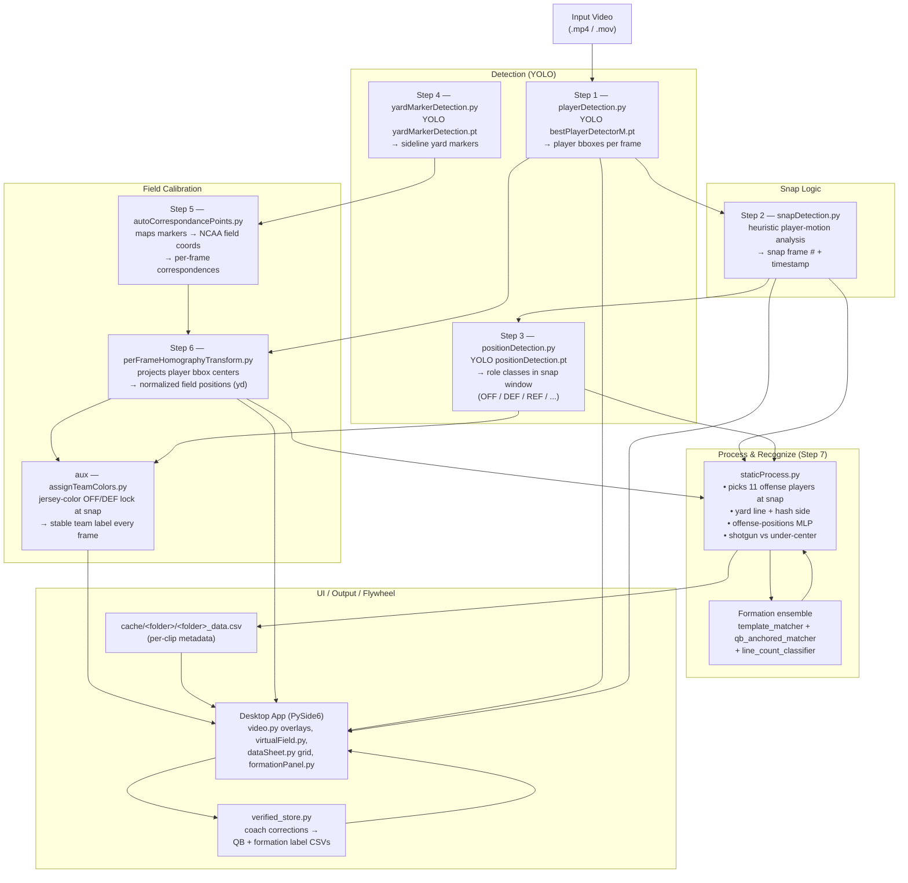

# Software Architecture

This document describes the architecture of the Hudl AI Analysis tool: a PySide6
desktop application that ingests football game video and produces per-play
analytics (snap frame, player positions on a normalized field, offense/defense
team split, offense formation, yard line / hash). It is intended as a reference
for partner / report writing.

---

## 1. High-Level Workflow

The system takes an input video and pushes it through a fixed 7-step pipeline,
plus an auxiliary jersey-color team step. Each step writes a JSON artifact into
`cache/<folder>/...`; the next step reads that artifact. The desktop UI overlays
these artifacts on the video and on a virtual field, stores per-clip metadata in
a folder-level CSV, and lets the coach **verify / correct** the result, which is
persisted as labeled training data (the "flywheel").



### One-line summary of the data flow

`video → players (YOLO) → snap frame → positions (YOLO) + yard markers (YOLO)
→ field homography → jersey-color team split → static process → formation
ensemble → CSV + UI overlay → coach verifies → label CSVs`

---

## 2. Component Layout

| Folder            | Purpose                                                                                       |
| ----------------- | --------------------------------------------------------------------------------------------- |
| `app/`            | PySide6 desktop GUI (main window, video player, virtual field, data sheet, formation panel, processing dialogs) |
| `scripts/`        | The 7-step processing pipeline + jersey-color step + utilities (`renderFieldVideo.py`, `shotgunDetection.py`) |
| `formations/`     | Formation recognizers (template, QB-anchored, line-count), the ensemble predictor, jersey-color team split, the verified-label store, and evaluation scripts |
| `models/`         | Offense-positions MLP weights + metadata, consumed by Step 7                                  |
| `yolo_models/`    | YOLO weights (Git LFS): player detector, position detector, yard-marker detector              |
| `modelTraining/`  | Training utilities for the offense-positions model (not bundled in the EXE)                   |
| `cache/`          | Runtime per-folder JSON + CSV artifacts produced by the pipeline, plus `verified/` coach labels (not checked in) |
| `data/`           | Local-only training/validation video data — gitignored                                        |

---

## 3. Pipeline Steps in Detail

Each step is independently runnable for iteration, and the processing dialogs
in `app/processingDialog.py` (single clip) and `app/batchProcessingDialog.py`
(whole folder) orchestrate Steps 1–7 end-to-end. Both skip steps whose output
already exists (homography is the "done" gate) and offer a force-rerun.

| # | Script                            | Model                              | Input                                       | Output                                  |
| - | --------------------------------- | ---------------------------------- | ------------------------------------------- | --------------------------------------- |
| 1 | `playerDetection.py`              | `bestPlayerDetectorM.pt` (YOLO)    | video                                       | per-frame player bboxes (JSON)          |
| 2 | `snapDetection.py`                | heuristic (motion analysis)        | player JSON                                 | snap frame # + timestamp (JSON)         |
| 3 | `positionDetection.py`            | `positionDetection.pt` (YOLO)      | video + snap JSON                           | role classes in the snap window (JSON)  |
| 4 | `yardMarkerDetection.py`          | `yardMarkerDetection.pt` (YOLO)    | video                                       | yard markers per frame (JSON)           |
| 5 | `autoCorrespondancePoints.py`     | —                                  | yard-marker JSON                            | pixel ↔ field coord pairs (JSON)        |
| 6 | `perFrameHomographyTransform.py`  | OpenCV homography                  | player JSON + correspondence JSON           | normalized field positions in yd (JSON) |
| 7 | `staticProcess.py`                | offense-positions MLP + formation ensemble | snap + position + homography JSON | per-clip CSV row (yard line, hash, formations, front count) |

### Auxiliary / processing helpers

- `scripts/assignTeamColors.py` — **jersey-color team step.** The role detector
  (Step 3) only fires in the snap window, so app-side team coloring would flicker
  to grey outside it. This step locks the offense/defense jersey colors once at
  the snap (via `formations/jersey_color.py`), then colors every player in every
  frame by nearest locked color and writes `team` (`offense`/`defense`/`None`)
  into the homography JSON in place. The app reads it directly for stable
  red/blue from first frame to last.
- `scripts/shotgunDetection.py` — heuristic on Step 7 data to flag shotgun vs.
  under-center; called from inside `staticProcess.py`.
- `scripts/renderFieldVideo.py` — renders the normalized positions to a stylized
  field video for debugging.
- `formations/validate_formations.py`, `validate_line_count.py`, and the
  `eval_*.py` scripts — offline accuracy harnesses comparing predictions against
  the coach's `breakdown.xlsx` labels.

---

## 4. Formation Recognition (ensemble, no end-to-end NN)

Formation recognition is **not** a single trained classifier. It is an ensemble
of geometric (untrained) signals, chosen because we only have ~89 noisy labeled
clips across 24 formation classes — too few to train a reliable network, and the
wide-angle film resolution hides the depth cues that separate variants. The
three signals all read the 11 offense players at the snap (extracted by
`staticProcess.py`):

1. **`template_matcher.py`** — matches the layout against 17 canonical formations.
   It builds an 11-point template (6 skill players from the CSV + 5 OL on the
   LOS), canonicalizes detected and template sets via PCA → center → isotropic
   RMS scale (invariant to field location, orientation, and schematic-vs-measured
   scale), then does a mirror-invariant Hungarian assignment. Returns the closest
   formation + a 0–1 distance score. Its top-1 is weak (~14% exact) but its
   **top-5 holds the right answer ~45% of the time**, so it serves as a candidate
   generator.
2. **`qb_anchored_matcher.py`** — identifies the QB (and TE) geometrically and
   pins them before assignment, which prevents the role swaps that hurt the plain
   matcher. Falls back gracefully to the legacy matcher.
3. **`line_count_classifier.py`** — counts how many offense players are on the
   line of scrimmage, the strength (left / right / balanced), and the structural
   bucket (e.g. 3x1 vs 2x2). No matching, no training — this **structure read is
   the most reliable single signal at ~60–70%** and is the primary value for the
   coach's film breakdown today.

**`formation_predictor.py`** fuses these into an ensemble: template-match scores
× a playbook prior (built from 1025 historical `OFF FORM` labels in
`breakdown.xlsx`, where this team's calls are heavily concentrated) × the
line-count structure as soft re-ranking evidence.

### Measured accuracy (56 labeled eval clips)

| Method                         | Exact  | Family |
| ------------------------------ | ------ | ------ |
| Template matcher (top-1)       | 14.3%  | 26.8%  |
| Ensemble predictor             | 26.8%  | 33.9%  |
| Playbook-prior-only floor      | 19.4%  | 25.7%  |
| Line-count structure bucket    | —      | ~60–70% |

These are below the project's stretch targets (90% family); exact-variant
accuracy is capped mainly by camera angle, not by the algorithm. The line-count
structure read and the human-in-the-loop verification below are how the tool
stays useful in the meantime.

---

## 5. Human-in-the-Loop Verification & Data Flywheel

Because the models are imperfect, the GUI is built to make errors visible and
correctable, and to capture each correction as labeled training data.

- **`app/formationPanel.py`** — shows the system's top pick with a confidence,
  the top-3 recommended formations (with hover preview), and an all-17 dropdown,
  plus a top-down formation diagram. A **Confirm** button records the coach's
  final choice and whether they agreed with or overrode the system.
- **Verify QB** (`app/video.py`) — a toggle; when on, the coach clicks the QB on
  the snap frame. The app records the pixel location + frame + nearest detection
  track, anchoring the read.
- **Agreement badge** — the video overlay shows a green check when the model and
  the QB-anchored matcher agree on the base formation family, and an orange "?"
  when they disagree, so uncertainty is visible at a glance.
- **Trained-status indicators** (`app/dataSheet.py`) — per-clip status in the
  grid: green = full pipeline done (homography complete), yellow = detection done
  but no homography, uncolored = not started, with live legend counts.

All corrections persist through **`formations/verified_store.py`** into
`cache/<folder>/verified/`:

| File                             | Shape         | Contents                                                                 |
| -------------------------------- | ------------- | ------------------------------------------------------------------------ |
| `qb_training_labels.csv`         | 1 row / clip  | verified QB `frame, x, y, matched_track_id, matched_class, verified_at`   |
| `formation_training_labels.csv`  | 1 row / clip  | `chosen_formation, system_pick, system_confidence, agreed, verified_at`   |
| `formation_history.csv`          | append-only   | audit trail: `seq, chosen, previous, system_pick, confidence, agreed, ts` |

These CSVs **collect** labeled corrections for future model retraining — the
system does not yet auto-retrain from them. The verified labels are never fed
back into the template matcher's reference set; they are ground-truth output.

---

## 6. Desktop Application (`app/`)

| Module                      | Role                                                                  |
| --------------------------- | --------------------------------------------------------------------- |
| `application.py`            | `QMainWindow`, menu bar, dock layout, folder selection, dark mode     |
| `video.py`                  | Video player + overlays (player bboxes, snap marker, formation label, agreement badge, Verify-QB mode) |
| `virtualField.py`          | 2D field view fed by Step 6 normalized positions + jersey-color team |
| `dataSheet.py`              | Editable per-clip metadata grid backed by `<folder>_data.csv`, with trained-status coloring |
| `formationPanel.py`         | Formation pick / top-3 / dropdown + Confirm → `verified_store`        |
| `fileAccess.py`             | Folder browser + thumbnail generation + CSV schema                    |
| `processingDialog.py`       | Single-clip Step 1–7 runner                                           |
| `batchProcessingDialog.py`  | Whole-folder Step 1–7 runner (parallel, skip-existing)                |
| `scriptUtils.py`            | Helpers for invoking pipeline scripts (frozen + dev)                  |
| `palette.py`                | Light / dark Qt palettes                                              |

When the build is frozen by PyInstaller (`hudl_ai.spec`), the dialogs re-invoke
the bundled executable with `PYINSTALLER_RUN_SCRIPT` so each script runs inside
the frozen interpreter without needing system Python.

---

## 7. Models

| Model                                  | Type           | Used by                          |
| -------------------------------------- | -------------- | -------------------------------- |
| `yolo_models/bestPlayerDetectorM.pt`   | YOLO (ultralytics) | Step 1 (player detection)    |
| `yolo_models/positionDetection.pt`     | YOLO           | Step 3 (snap-window roles: OFF/DEF/REF) |
| `yolo_models/yardMarkerDetection.pt`   | YOLO           | Step 4 (sideline markers)        |
| `models/offense_positions/`            | PyTorch MLP    | Step 7 (offense play-type / `OFF FORM`) |
| `formations/offense_formation_coordinates_17.csv` | template set | Step 7 (template / QB-anchored matchers) |
| jersey-color k-means (no weights)      | classical CV   | `assignTeamColors.py` whole-clip team split |

Note the two-layer team identity: `positionDetection.pt` gives roles only inside
the snap window, while jersey-color clustering provides a stable offense/defense
label across the whole clip.

---

## 8. Runtime Artifacts (`cache/<folder>/`)

```
cache/<folder>/
├── players/<clip>_detection.json              # Step 1
├── snap_detection/<clip>_snap_detection.json  # Step 2
├── positions/<clip>_position.json             # Step 3
├── yard_markers/<clip>_yard_markers.json      # Step 4
├── correspondence/<clip>_correspondence.json  # Step 5
├── homography/<clip>_normalized_positions.json # Step 6 (+ team color from assignTeamColors)
├── offense_positions.csv                      # Step 7 training-data append
├── <folder>_data.csv                          # Step 7 per-clip metadata (UI source of truth)
└── verified/
    ├── qb_training_labels.csv                 # coach QB verifications
    ├── formation_training_labels.csv          # coach formation choices
    └── formation_history.csv                  # append-only correction audit trail
```

`<folder>_data.csv` is the UI source of truth. Its columns include `CLIP NAME`,
`YARD LINE`, `PERSONNEL`, `BACKFIELD`, `FRONT COUNT`, `FRONT STRENGTH`,
`OFF FORM` (MLP), `TEMPLATE FORM` / `TEMPLATE SCORE`, `QB FORM` / `QB SCORE`,
`QB ALIGN`, `SET`, and `WR SPLITS`. Each JSON above is also overlay-ready:
`video.py` reads the player + snap JSONs to draw bboxes and the snap marker;
`virtualField.py` reads the homography JSON (with the per-frame team color) to
animate dots on the 2D field.

---

## 9. End-to-End Example

```
input.mp4
  │
  ▼  Step 1 (YOLO)         players JSON  ─────────────────────────────────┐
  │                                                                       │
  ▼  Step 2 (heuristic)    snap frame # ─────────────────────────────┐    │
  │                                                                   │    │
  ▼  Step 3 (YOLO @ snap)  roles JSON   ──────────────────────┐      │    │
  │                                                            │      │    │
  ▼  Step 4 (YOLO)         yard markers JSON                   │      │    │
  │                                │                           │      │    │
  ▼  Step 5                correspondence JSON                 │      │    │
  │                                │                           │      │    │
  ▼  Step 6 (homography)   normalized positions (yd) ──────────┼──────┼────┤
  │            └─ aux: assignTeamColors → team color           │      │    │
  ▼                                                            │      │    │
  Step 7  staticProcess.py ◄─────────────────────────────────┴──────┴────┘
      │
      ├─► offense-positions MLP        ─► OFF FORM (model)
      ├─► template + QB-anchored match ─► TEMPLATE FORM / QB FORM + scores
      ├─► line_count_classifier        ─► FRONT COUNT / FRONT STRENGTH
      ├─► shotgunDetection             ─► SET (shotgun / under-center)
      ├─► yard line + hash side
      └─► writes <folder>_data.csv     ─► UI overlay
                                            │
                                            ▼  coach reviews in formationPanel
                                         Verify QB / Confirm formation
                                            │
                                            ▼  verified_store → label CSVs (flywheel)
```
